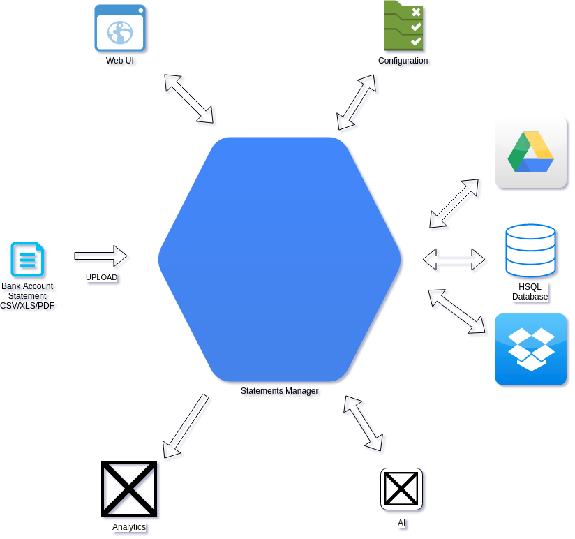

# Statements
Bank Statement Manager
A Java/J2EE based web application to manage financial transactions e.g. Bank accounts, Credit card, Wallets, etc.

This project is open source under [Apache License 2.0](https://www.apache.org/licenses/LICENSE-2.0)

# Solution Architecture

Refer project [wiki](https://github.com/Jayeshecs/statements/wiki) for detail of below -
1) Solution requirements
2) Technical solution
3) Development environment setup

TODO -
1) Advance setup documentation
2) Development environment setup documentation
3) Frequently asked questions

